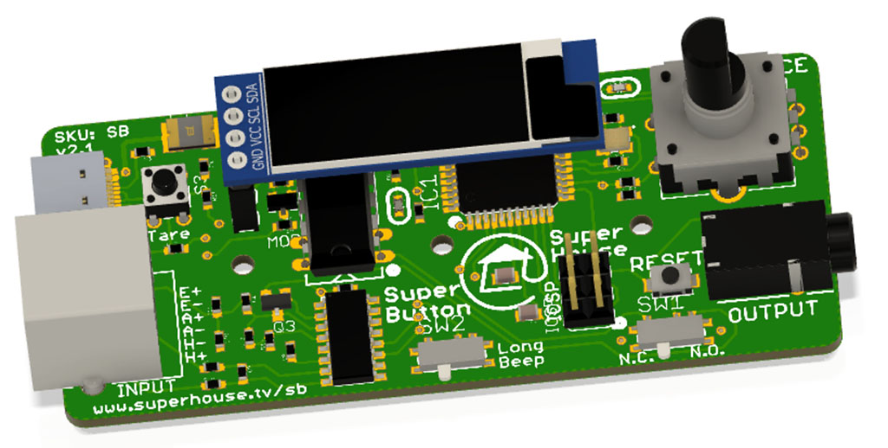

"SuperButton" Assistive Technology Button
=========================================

Provides a simple dry-contact output assistive-technology
button using a load cell, so that the force required to activate
the button can be adjusted to suit the needs of the user.

The activation pressure can be adjusted by clicking the rotary
encoder and then rotating the encoder. Clicking the button again
applies the new setting and saves it in EEPROM. When it hasn't
been clicked into adjustment mode, the rotary encoder is ignored
so that it can't be accidentally bumped to a different setting.

The load cell reading is zeroed at startup, and can also be
re-zeroed by pressing the "tare" button.

The output duration can directly match the button press, or it
can be "stretched" to allow even a quick tap to cause a longer
beep output. The beep stretching switch activates this option.

Features:

 * 1 x input connection for a load-cell based button
 * 1 x USB connection for power or to emulate an input device
 * 1 x switched output (either N.O. or N.C.) to control other devices
 * 128x32 OLED to show current force reading and activation threshold
 * Rotary encoder to adjust activation threshold
 * "Tare" button to reset zero point
 * Pulse stretching feature controlled by slide switch

More information is available at:

  https://www.superhouse.tv/superbutton

Hardware
--------
The "Hardware" directory contains the PCB design as an EAGLE project.
EAGLE PCB design software is available from Autodesk free for
non-commercial use.

Firmware
--------
The "Firmware" directory contains example firmware as an Arduino
project.

Credits
-------
 * Jonathan Oxer <jon@oxer.com.au>
 * Chris Fryer <chris.fryer78@gmail.com>

License
-------
Copyright 2019-2020 SuperHouse Automation Pty Ltd  www.superhouse.tv  

The hardware portion of this project is licensed under the TAPR Open
Hardware License (www.tapr.org/OHL). The "license" folder within this
repository contains a copy of this license in plain text format.

The software portion of this project is licensed under the Simplified
BSD License. The "licence" folder within this project contains a
copy of this license in plain text format.
